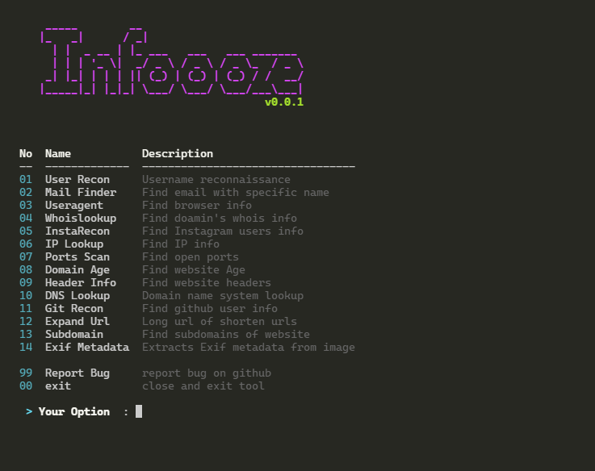
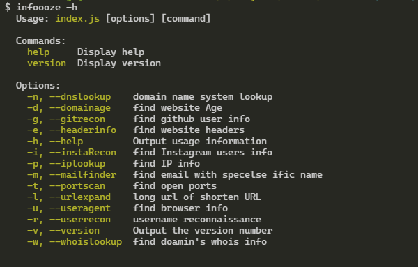
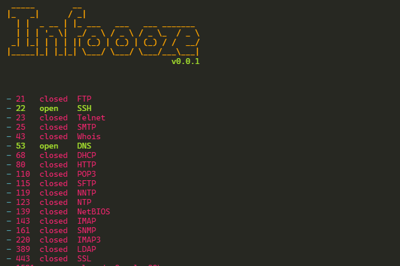
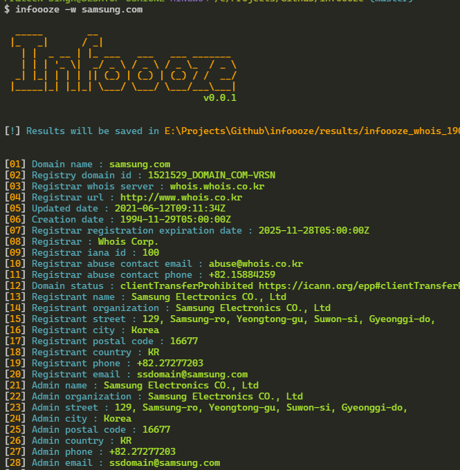
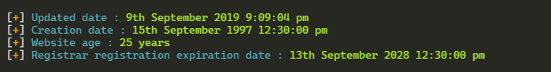

<div align="center">

# 🔍 FouadOSINT


### *Advanced Open-Source Intelligence Framework*

[](https://github.com/fouadzalaf/fouadosint/stargazers)
[](https://www.npmjs.com/package/fouadosint)
[](LICENSE)
[](https://www.npmjs.com/package/fouadosint)

<p align="center">
  <a href="#-features">Features</a> •
  <a href="#-installation">Installation</a> •
  <a href="#-usage">Usage</a> •
  <a href="#-connect-with-me">Connect</a> •
  <a href="#-contributing">Contributing</a>
</p>

---

</div>

## 🎯 About FouadOSINT

**FouadOSINT** is a cutting-edge, professional-grade OSINT (Open-Source Intelligence) framework designed for cybersecurity professionals, penetration testers, and digital investigators. Built with modern architecture and advanced intelligence gathering capabilities, FouadOSINT empowers you to conduct comprehensive reconnaissance operations with precision and efficiency.

### ✨ Why FouadOSINT?

- 🚀 **Blazing Fast** - Optimized performance for rapid intelligence gathering
- 🎨 **Modern Interface** - Sleek command-line interface with intuitive navigation
- 🌐 **Global Access** - Works as a global npm package, accessible from anywhere
- 💾 **Smart Results** - Automatic result saving with organized output
- 🔐 **Security First** - Built with security and privacy in mind
- 🛠️ **Modular Design** - Extensible architecture for custom integrations 

## 🔥 Features

<table>
<tr>
<td width="50%">

### 🎯 Social Media Intelligence
- 📸 **Instagram Reconnaissance** - Deep profile analysis
- 👤 **Multi-Platform User Recon** - Cross-platform tracking
- 🐙 **GitHub Intelligence** - Developer profiling
- 📹 **YouTube Metadata Extractor** - Video intelligence

### 🌐 Network & Domain Intelligence
- 🔍 **Advanced Subdomain Scanner** - Find hidden subdomains
- 🛡️ **Port Scanner** - Identify open ports & services
- 🌍 **IP Geolocation & Lookup** - Precise IP intelligence
- 📋 **DNS Records Analysis** - Complete DNS enumeration

</td>
<td width="50%">

### 🔐 Web Security & Analysis
- 📊 **HTTP Headers Inspector** - Security header analysis
- 🔗 **URL Scanner & Expander** - Analyze suspicious URLs
- ⏰ **Domain Age Checker** - Historical domain data
- 🔎 **WHOIS Lookup** - Registration intelligence

### 📧 Data Extraction & Analysis
- ✉️ **Email Finder** - Discover email addresses
- 🖼️ **EXIF Metadata Extractor** - Image forensics
- 🌐 **User-Agent Parser** - Browser fingerprinting
- 💾 **Auto-Save Results** - Organized output management

</td>
</tr>
</table>

### 🖥️ Platform Support

<div align="center">

| 🐧 Linux | 📱 Termux | 🪟 Windows | 🍎 macOS |
|:--------:|:---------:|:----------:|:--------:|
|    ✅    |     ✅     |     ✅     |    ✅    |

**Fully tested and optimized for all major platforms**

</div>

---

## 📦 Installation

### Prerequisites

**Node.js 12+** is required. Install it for your platform:

<details>
<summary><b>🐧 Linux / Debian / Ubuntu</b></summary>

```bash
# Install Node.js
sudo apt-get update
sudo apt-get install nodejs npm -y

# Verify installation
node --version
npm --version
```
</details>

<details>
<summary><b>📱 Termux (Android)</b></summary>

```bash
# Update packages
pkg update && pkg upgrade

# Install Node.js
pkg install nodejs-lts

# Verify installation
node --version
npm --version
```
</details>

<details>
<summary><b>🪟 Windows</b></summary>

1. Download Node.js LTS from [nodejs.org](https://nodejs.org)
2. Run the installer
3. Follow installation wizard
4. Restart your computer
5. Verify: Open CMD/PowerShell and run `node --version`
</details>

<details>
<summary><b>🍎 macOS</b></summary>

```bash
# Using Homebrew
brew install node

# Or download from nodejs.org
# Verify installation
node --version
npm --version
```
</details>

### 🚀 Quick Installation

Install **FouadOSINT** globally with a single command:

```bash
# For Linux/macOS
sudo npm install -g fouadosint

# For Termux/Windows (no sudo)
npm install -g fouadosint
```

### 🗑️ Uninstall

```bash
npm remove -g fouadosint
```

---

## 🚀 Usage

Launch **FouadOSINT** from any terminal:

```bash
fouadosint [options] [target]
```

**Alternative commands:**
```bash
fosint [options] [target]  # Short version
fosi [options] [target]    # Ultra-short version
```

### 🛠️ Command Options

<table>
<thead>
<tr>
<th align="center">🔹 Flag</th>
<th align="center">📝 Option</th>
<th align="left">📄 Description</th>
</tr>
</thead>
<tbody>
<tr>
<td align="center"><code>-r</code></td>
<td align="center"><code>--userrecon</code></td>
<td>🔍 <b>User Reconnaissance</b> - Track usernames across 300+ social platforms</td>
</tr>
<tr>
<td align="center"><code>-m</code></td>
<td align="center"><code>--mailfinder</code></td>
<td>✉️ <b>Email Discovery</b> - Find email addresses linked to domains/usernames</td>
</tr>
<tr>
<td align="center"><code>-i</code></td>
<td align="center"><code>--instaRecon</code></td>
<td>📸 <b>Instagram OSINT</b> - Deep profile analysis & follower intelligence</td>
</tr>
<tr>
<td align="center"><code>-g</code></td>
<td align="center"><code>--gitrecon</code></td>
<td>🐙 <b>GitHub Intelligence</b> - Developer profiling & repository analysis</td>
</tr>
<tr>
<td align="center"><code>-y</code></td>
<td align="center"><code>--youtubelookup</code></td>
<td>📹 <b>YouTube Metadata</b> - Extract video information & channel data</td>
</tr>
<tr>
<td align="center"><code>-w</code></td>
<td align="center"><code>--whoislookup</code></td>
<td>🔎 <b>WHOIS Lookup</b> - Domain registration & ownership intelligence</td>
</tr>
<tr>
<td align="center"><code>-p</code></td>
<td align="center"><code>--iplookup</code></td>
<td>🌍 <b>IP Geolocation</b> - Geographic location & ISP information</td>
</tr>
<tr>
<td align="center"><code>-s</code></td>
<td align="center"><code>--subdomain</code></td>
<td>🔍 <b>Subdomain Scanner</b> - Discover hidden subdomains</td>
</tr>
<tr>
<td align="center"><code>-n</code></td>
<td align="center"><code>--dnslookup</code></td>
<td>📋 <b>DNS Records</b> - Complete DNS enumeration & analysis</td>
</tr>
<tr>
<td align="center"><code>-t</code></td>
<td align="center"><code>--portscan</code></td>
<td>🛡️ <b>Port Scanner</b> - Identify open ports & running services</td>
</tr>
<tr>
<td align="center"><code>-e</code></td>
<td align="center"><code>--headerinfo</code></td>
<td>📊 <b>HTTP Headers</b> - Analyze security headers & configurations</td>
</tr>
<tr>
<td align="center"><code>-d</code></td>
<td align="center"><code>--domainage</code></td>
<td>⏰ <b>Domain Age</b> - Check domain registration history</td>
</tr>
<tr>
<td align="center"><code>-a</code></td>
<td align="center"><code>--webscan</code></td>
<td>🔗 <b>URL Scanner</b> - Analyze suspicious URLs for threats</td>
</tr>
<tr>
<td align="center"><code>-l</code></td>
<td align="center"><code>--urlexpand</code></td>
<td>🔗 <b>URL Expander</b> - Reveal full destinations of shortened URLs</td>
</tr>
<tr>
<td align="center"><code>-x</code></td>
<td align="center"><code>--exif</code></td>
<td>🖼️ <b>EXIF Extractor</b> - Image metadata & geolocation forensics</td>
</tr>
<tr>
<td align="center"><code>-u</code></td>
<td align="center"><code>--useragent</code></td>
<td>🌐 <b>User-Agent Parser</b> - Browser & device fingerprinting</td>
</tr>
</tbody>
</table>


### 💡 Usage Examples

<details open>
<summary><b>🎯 Basic Commands</b></summary>

```bash
# Launch interactive menu
fouadosint

# Show help and all options
fouadosint -h

# Update to latest version
npm update -g fouadosint
```
</details>

<details>
<summary><b>📸 Social Media Intelligence</b></summary>

```bash
# Instagram reconnaissance
fouadosint -i username

# Multi-platform user search
fouadosint -r johndoe

# GitHub profile analysis
fouadosint -g octocat

# YouTube video metadata
fouadosint -y VIDEO_URL
```
</details>

<details>
<summary><b>🌐 Domain & Network Analysis</b></summary>

```bash
# WHOIS lookup
fouadosint -w example.com

# Find subdomains
fouadosint -s target.com

# DNS records
fouadosint -n example.com

# Port scanning
fouadosint -t example.com

# Domain age check
fouadosint -d example.com
```
</details>

<details>
<summary><b>🔍 Advanced OSINT</b></summary>

```bash
# IP geolocation
fouadosint -p 8.8.8.8

# Email discovery
fouadosint -m @domain.com

# Extract EXIF from image
fouadosint -x /path/to/image.jpg

# Analyze suspicious URL
fouadosint -a https://suspicious-link.com

# Expand shortened URL
fouadosint -l https://bit.ly/example

# Parse User-Agent string
fouadosint -u "Mozilla/5.0..."
```
</details>

---

## 📸 Screenshots

<div align="center">

<table>
<tr>
<td width="50%">

</td>
<td width="50%">

</td>
</tr>
<tr>
<td width="50%">

</td>
<td width="50%">

</td>
</tr>
<tr>
<td colspan="2">

</td>
</tr>
</table>

</div>

---

## 🤝 Contributing

<div align="center">

**Contributions make the open-source community thrive! Your contributions are greatly appreciated.**

</div>

### 🌟 How to Contribute

1. **Fork** the repository
2. **Clone** your fork locally
   ```bash
   git clone https://github.com/YOUR_USERNAME/fouadosint.git
   ```
3. **Create** a new branch
   ```bash
   git checkout -b feature/amazing-feature
   ```
4. **Make** your changes
5. **Commit** your changes
   ```bash
   git commit -m "✨ Add amazing feature"
   ```
6. **Push** to your fork
   ```bash
   git push origin feature/amazing-feature
   ```
7. **Open** a Pull Request

### 💡 Contribution Ideas

- 🐛 Report bugs
- ✨ Suggest new features
- 📝 Improve documentation
- 🔧 Submit pull requests
- 🌍 Add translations

---

## 👥 Contributors

Thank you to all contributors who helped make FouadOSINT better!

[](https://github.com/fouadzalaf/fouadosint/graphs/contributors)

---

## 📫 Connect With Me

<div align="center">

### **Fouad Zalaf**

[](https://instagram.com/1.pvl)
[](https://instagram.com/fod1v)
[](mailto:zalaffouad37@gmail.com)
[](https://github.com/fouadzalaf)

</div>

---

## 📄 License

<div align="center">

**MIT License** © 2024 Fouad Zalaf

This project is licensed under the MIT License - see the [LICENSE](LICENSE) file for details.

[](LICENSE)

</div>

---

<div align="center">

### ⭐ Show Your Support

If you find **FouadOSINT** helpful, please give it a star!

[](https://github.com/fouadzalaf/fouadosint/stargazers)
[](https://github.com/fouadzalaf/fouadosint/network/members)

---

**Made with ❤️ by Fouad Zalaf**

*Empowering Security Professionals with Advanced OSINT Capabilities*

</div>
